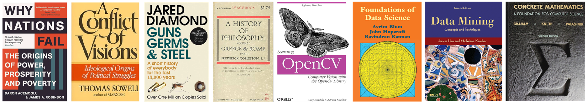

I read about technologies, philosophy and history.

**Why Nations Fail: The Origins of Power, Prosperity, and Poverty**, Daron Acemoglu and James A. Robinson. [Free Resource](https://ia601506.us.archive.org/27/items/WhyNationsFailTheOriginsODaronAcemoglu/Why-Nations-Fail_-The-Origins-o-Daron-Acemoglu.pdf)

**A Conflict of Visions: Ideological Origins of Political Struggles**, Thomas Sowell. [Resource](https://archive.org/details/conflictofvision0000sowe)

**Guns, Germs, and Steel: The Fates of Human Societies**, Jared Diamond. [Free Resource](https://ia600201.us.archive.org/26/items/fp_Jared_Diamond-Guns_Germs_and_Steel/Jared_Diamond-Guns_Germs_and_Steel.pdf)

**A History of Philosophy**, Frederick Copleston. [Free Resource](https://archive.org/details/historyofphiloso03copl/page/n11/mode/2up)

**Learning OpenCV**, Gary Bradski and Adrian Kaehler. [Free Resource](https://github.com/JiashuWu/Books/blob/master/Computer%20Vision/Learning%20OpenCV%20OReilly.pdf)

**Foundations of Data Science**, Avrim Blum, John Hopcroft, and Ravindran Kannan. [Free Resource](https://github.com/JiashuWu/Books/blob/master/Data%20Science/Foundations%20of%20Data%20Science%20-%20Microsoft.pdf)

**Data Mining: Concepts and Techniques**, Jiawei Han, Micheline Kamber and Jian Pei. [Free Resource](https://github.com/JiashuWu/Books/blob/master/Data%20Mining/Data%20Mining%20Concepts%20and%20Techniques_3ed.pdf)

**Concrete Mathematics: A Foundation for Computer Science**, Ronald Graham, Donald Knuth and Oren Patashnik [Free Resource](https://github.com/djtrack16/thyme/blob/master/math/Concrete%20Mathematics%20A%20Foundation%20of%20Computer%20Science%202nd%20Edition.pdf)
