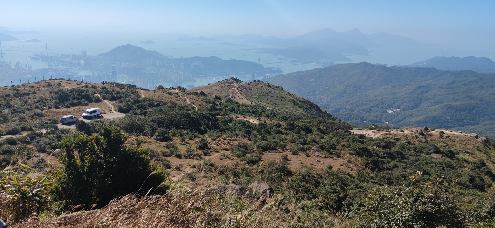
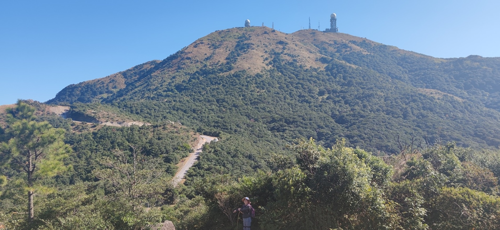

I'm currently based in Hong Kong, where most of my outdoor took place. I read blogs from [Hike Hong Kong](https://hikehk.com/) and [Oasistrek](https://www.oasistrek.com/) for preparation.

**Join me if you are another hiking passionate!**

## High Junk Peak on Oct 10, 2024

Amazing hiking day spent with Dr. Xue, paying his return visit to Hong Kong.

It's a pity that we did not conquer the peak due to limited time. The challenge is kept for the future!

## Great Ocean Road on Mar, 2024

Lasting memories along the Australian National Heritage-listed 240-kilometer stretch of road.

Memorial Arch, known as the "real start" of the Great Ocean Road.

Split Point Lighthoouse.

Map embedded in rock.

Waterfall of Carisbrook Creek.

Costal view at Lorne Pier.

📸Shot of the trip! Stunning sunset view at the "London Bridge".

Motel gate in Warrnambool. Yes, the car departed from NSW (check the license plate)!

## Kai Kung Leng on Nov 13, 2023

Miscanthus of the season.

## Tai Mo Shan on Dec 08, 2021

Wild monkey on the branch.

Rocks on the slope.

The weather radar station on Hong Kong's highest peak.

## Ng Tung Chai on Jul 31, 2021

Middle fall with a refreshing pool.

Main fall with a drop of 35 meters!

## High Island (East Dam) on Jul 10, 2021

Part of the MacLehouse Trail Section 1.

The freshwater in the reservoir reflects a lighter shade of blue than the sea.

View of Long Ke Wan Bay.

Ended near the eastern dam.