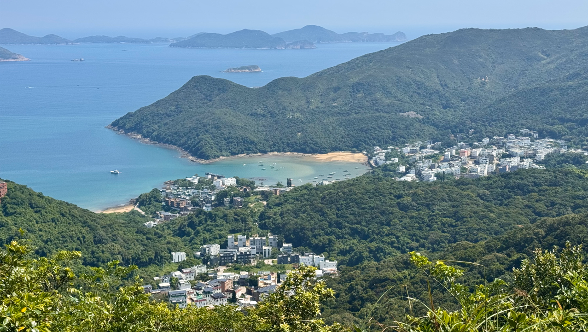
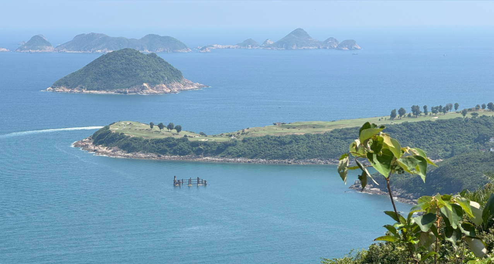
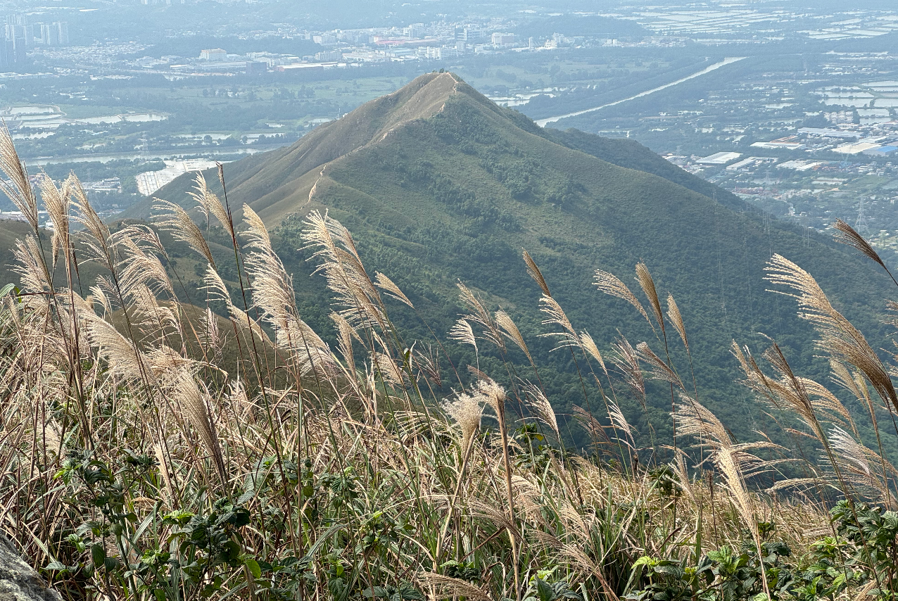
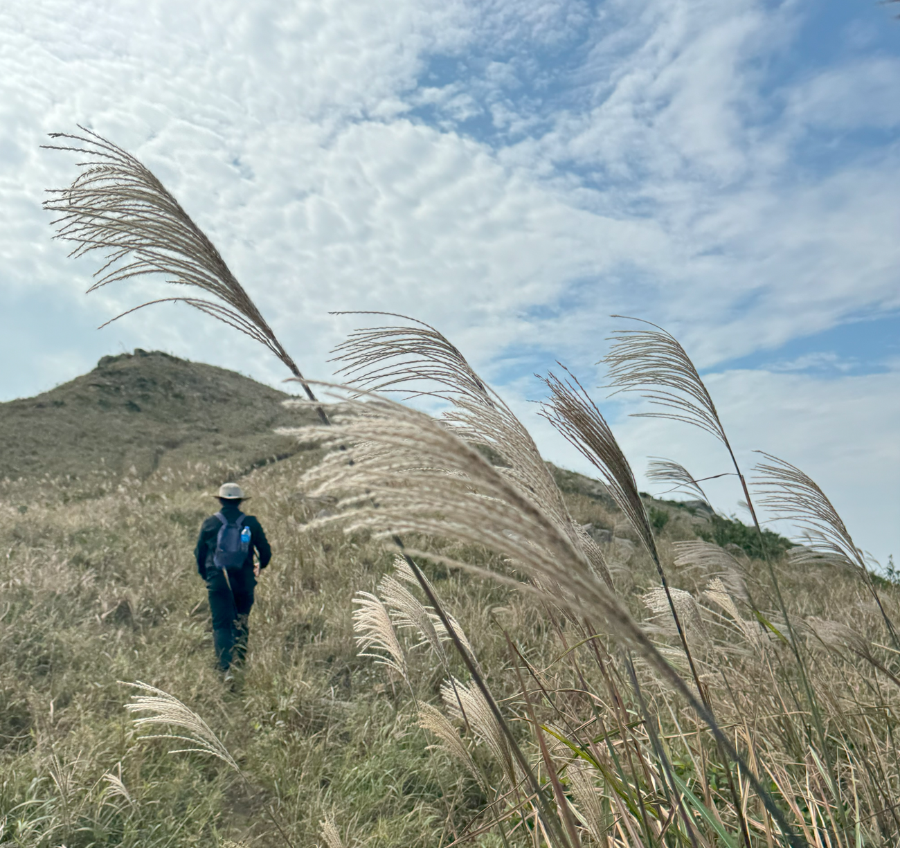
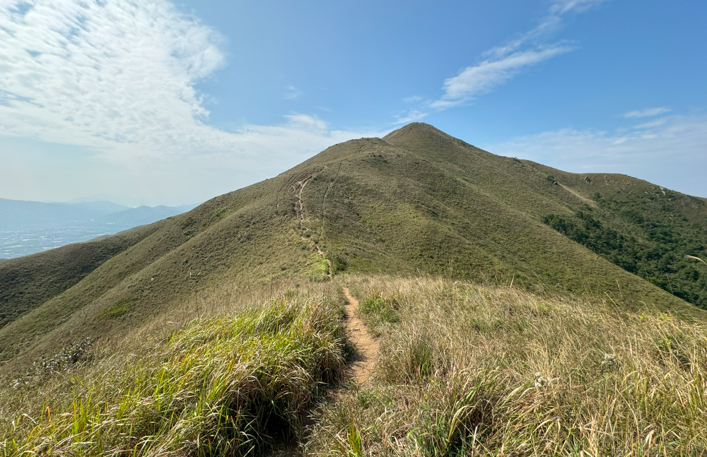
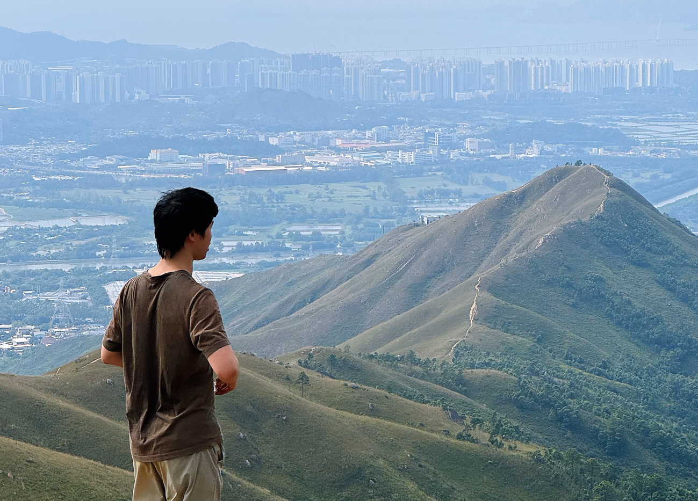

I'm currently based in Hong Kong, where most of my outdoor took place. I read blogs from [Hike Hong Kong](https://hikehk.com/) and [Oasistrek](https://www.oasistrek.com/) for preparation.

**Join me if you are another hiking passionate!**

## High Junk Peak on Oct 10, 2024

Amazing hiking day spent with Dr. Xue, paying his return visit to Hong Kong.

It's a pity that we did not conquer the peak due to limited time. The challenge is kept for the future!

## Kai Kung Leng on Nov 13, 2023

