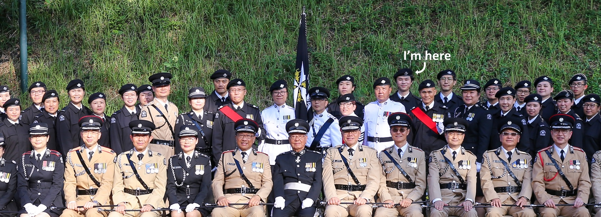

## First Aid Services

    

I obtained my Standard First Aid Certificate from [Hong Kong Red Cross](https://training.redcross.org.hk/tms/en/main.jspx) in April 2023 (re-issuance at Hong Kong St.John Ambulance in October 2024), and AED Provider Certificate from [Hong Kong St. John Ambulance](https://www.stjohn.org.hk/en/training-courses/course/automated-external-defibrillation-provider) in January 2024.

I have proudly served as a St. John Ambulance Hong Kong Island Command brigade member since July 2024.

