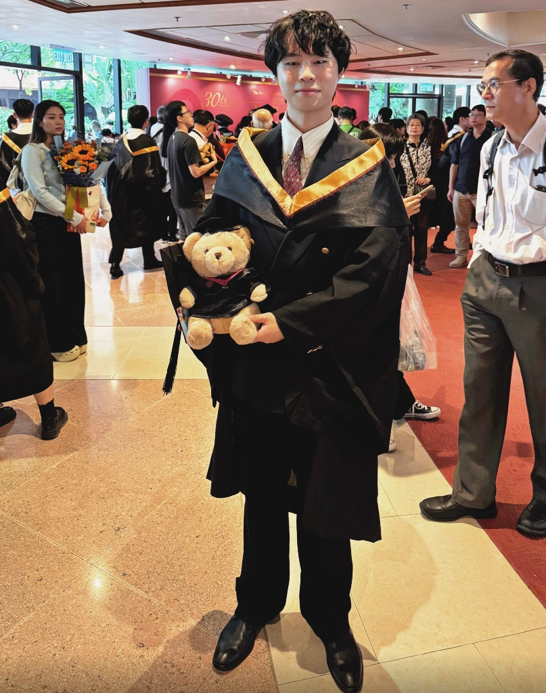

The congregation ceremony, according to the customs in Hong Kong, is conducted in November, following the presentation of the award parchment by three months. After a period of extended anticipation, the day has at last arrived!

I felt heartly grateful to the presence of my parents, who have graciously attended to support me during this pivotal moment in my life, and I extend my heartfelt thanks to the friends who joined me for the amazing photographs!

