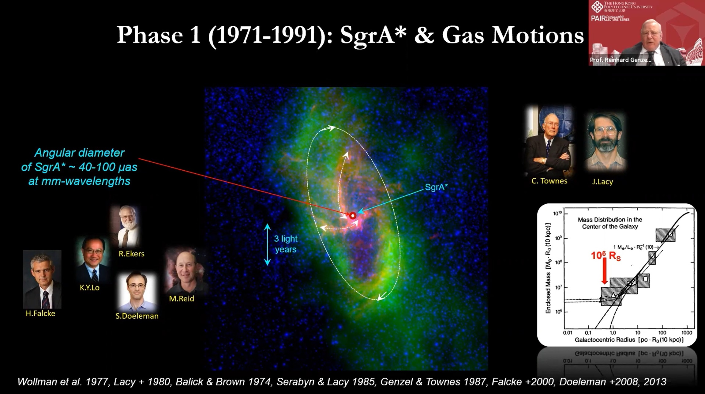

Thanks to the valuable chance offered by [PolyU Academy for Interdisciplinary Research](https://www.polyu.edu.hk/en/pair/), we were able to attend a distinguished lecture delivered by Prof. Reinhard Genzel, the Nobel Laureate of Physics in 2020!

Professor Genzel shared his forty-year journey, which his colleagues and himself have been undertaking to study the mass distribution in the centre of the Milky Way from ever more precise, long-term studies of the motions of gas and stars as test particles of the space time. They found that the existence of a four million solar mass object, which must be a single massive black hole, beyond any reasonable doubt.

The full recorded lecture is available [here](https://www.youtube.com/watch?v=m-nNZ_h16JE) on Youtube.