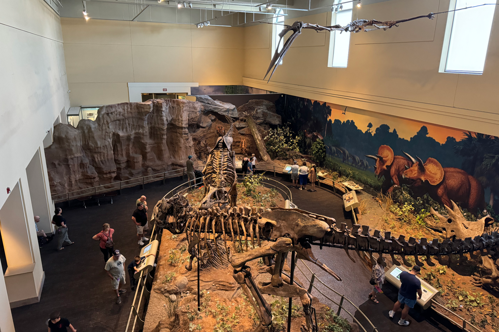

During the conference, we visited the City of Pittsburgh, a beautiful city with skyscrapers, bridges, a row of heights and trams!



I was shocked to see a rex fossil (Upon closer inspection, the platform at its feet turned to a wishing well) at the airport! Later on, I bumped into more of them at the [Carnegie Museum of Natural History](https://carnegiemnh.org/).


On board the well-known Duquesne Incline! It reminds me of The Peak Tram in Hong Kong Island.


Chilling out with attendees! We took this group shot at the Duquesne Heights observation deck.


It has been a routine for me to drop by the department of computer science every time I visit a new institution, including CMU...


Catching up baselines testings in the library.




Flying pillows at [The Andy Warhol Museum](https://www.warhol.org/). Strange yet fanscinating! I was delighted to learn about Andy's contributions to visual artworks and his significant impact on modern human artistry.

**Youtube**:

    



**Video file**

Videos may be added to a page by either placing them in your `assets/media/` media library or in your [page's folder](https://gohugo.io/content-management/page-bundles/), and then embedding them with the _video_ shortcode:

    

## Podcast

You can add a podcast or music to a page by placing the MP3 file in the page's folder or the media library folder and then embedding the audio on your page with the _audio_ shortcode:

    

Try it out:



## Test students

Provide a simple yet fun self-assessment by revealing the solutions to challenges with the `spoiler` shortcode:

```markdown

You found me!

```

renders as

 You found me 🎉 

## Math

Hugo Blox Builder supports a Markdown extension for $\LaTeX$ math. Enable math by setting the `math: true` option in your page's front matter, or enable math for your entire site by toggling math in your `config/_default/params.yaml` file:

```yaml
features:
  math:
    enable: true
```

To render _inline_ or _block_ math, wrap your LaTeX math with `$...$` or `$$...$$`, respectively.

Example **math block**:

```latex
$$
\gamma_{n} = \frac{ \left | \left (\mathbf x_{n} - \mathbf x_{n-1} \right )^T \left [\nabla F (\mathbf x_{n}) - \nabla F (\mathbf x_{n-1}) \right ] \right |}{\left \|\nabla F(\mathbf{x}_{n}) - \nabla F(\mathbf{x}_{n-1}) \right \|^2}
$$
```

renders as

$$\gamma_{n} = \frac{ \left | \left (\mathbf x_{n} - \mathbf x_{n-1} \right )^T \left [\nabla F (\mathbf x_{n}) - \nabla F (\mathbf x_{n-1}) \right ] \right |}{\left \|\nabla F(\mathbf{x}_{n}) - \nabla F(\mathbf{x}_{n-1}) \right \|^2}$$

Example **inline math** `$\nabla F(\mathbf{x}_{n})$` renders as $\nabla F(\mathbf{x}_{n})$.

Example **multi-line math** using the math linebreak (`\\`):

```latex
$$f(k;p_{0}^{*}) = \begin{cases}p_{0}^{*} & \text{if }k=1, \\
1-p_{0}^{*} & \text{if }k=0.\end{cases}$$
```

renders as

$$
f(k;p_{0}^{*}) = \begin{cases}p_{0}^{*} & \text{if }k=1, \\
1-p_{0}^{*} & \text{if }k=0.\end{cases}
$$

## Code

Hugo Blox Builder utilises Hugo's Markdown extension for highlighting code syntax. The code theme can be selected in the `config/_default/params.yaml` file.


    ```python
    import pandas as pd
    data = pd.read_csv("data.csv")
    data.head()
    ```

renders as

```python
import pandas as pd
data = pd.read_csv("data.csv")
data.head()
```

## Inline Images

```go
 Python
```

renders as

 Python

## Did you find this page helpful? Consider sharing it 🙌
