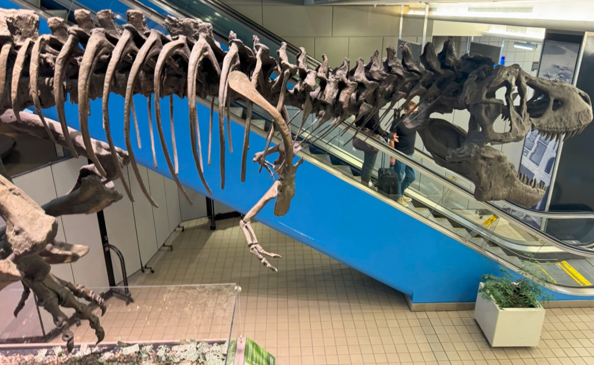
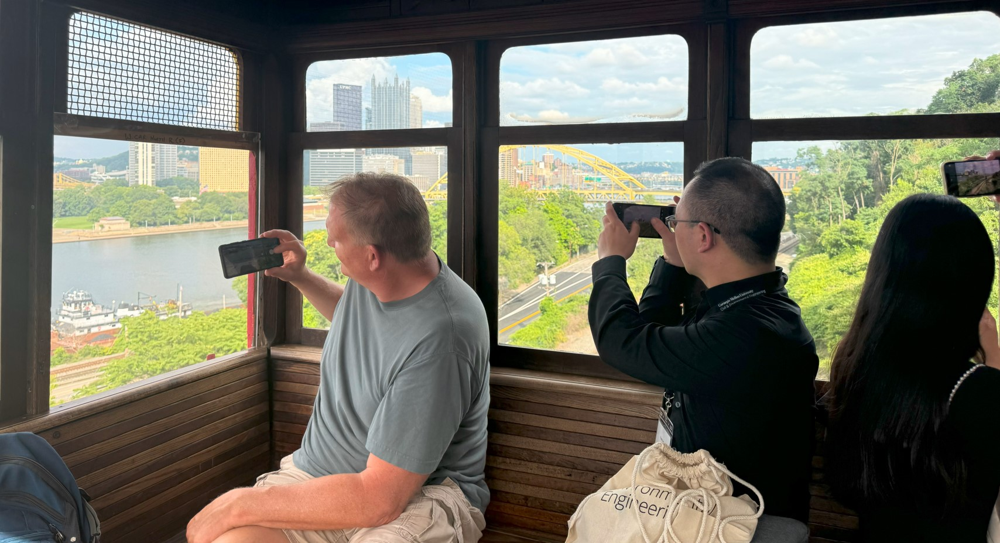

During the conference, we visited the City of Pittsburgh, a beautiful city with skyscrapers, bridges, a row of heights and trams!

I was shocked to see a rex fossil (Upon closer inspection, the platform at its feet turned to a wishing well) at the airport! Later on, I bumped into more of them at the [Carnegie Museum of Natural History](https://carnegiemnh.org/).

On board the well-known Duquesne Incline! It reminds me of The Peak Tram in Hong Kong Island.

Chilling out with attendees! We took this group shot at the Duquesne Heights observation deck.

It has been a routine for me to drop by the department of computer science every time I visit a new institution, including CMU...

Catching up baselines testings in the library.



Flying pillows at [The Andy Warhol Museum](https://www.warhol.org/). Strange yet fanscinating! I was delighted to learn about Andy's contributions to visual artworks and his significant impact on modern human artistry.

The historic Waco 9 airplane (known as "Miss Pittsburgh") marks the city's aviation history, known for making the first airmail flight from Pittsburgh to Cleveland, Ohio!

